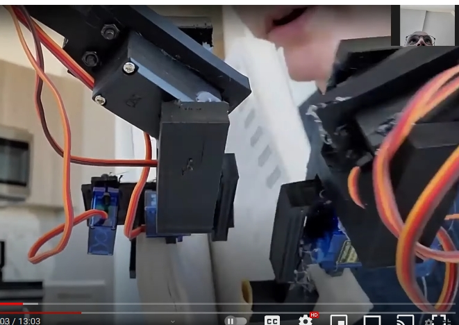
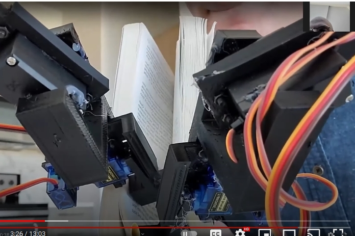
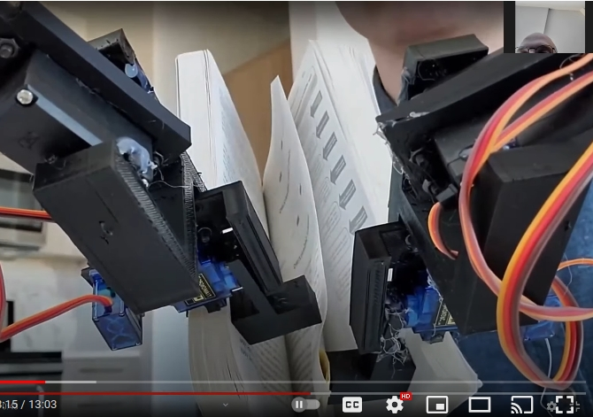
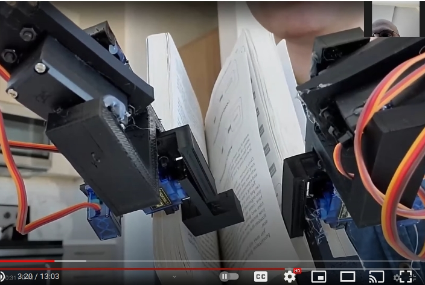
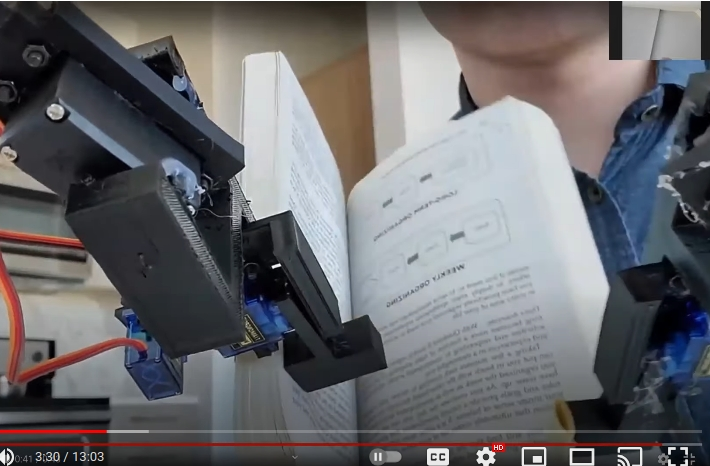

# Book turning robot

# How it works (w/ low quality pics)
### The hands start open

### The hands close to press the outside of the right sticky thumb against a page

### The hands open, pulling the page to the right
(I know this is "reading" the book backwards)

### The right thumb drops

### The right thumb raises to grip the newly turned page

